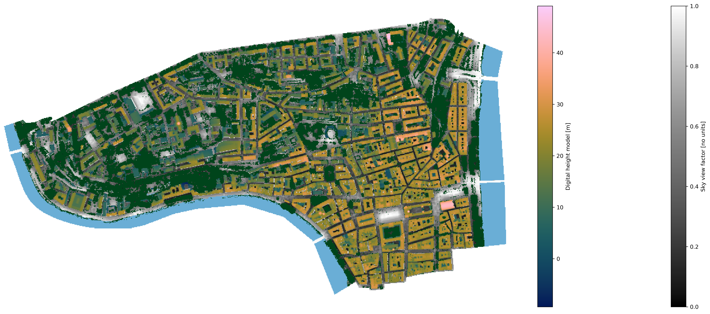
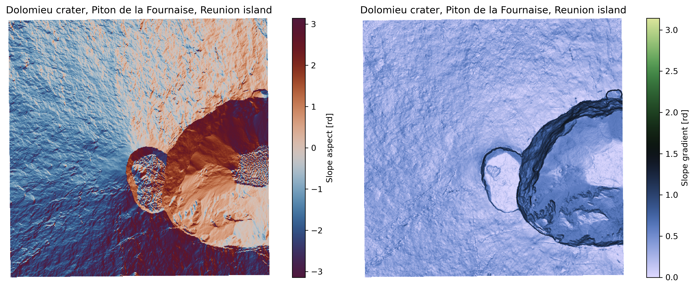

# `lidar_hd_tools`: for a quick and efficient loading of IGN’s LiDAR HD data



**Module’s name**: `lidar_hd_tools` \
**Release**: 0.1.1 \
**Date**: April 2026 \
**Author**: Thibault CHARDON (IPGP, Université Paris Cité) \
\
***CC-BY 4.0 licence** (https://creativecommons.org/licenses/by/4.0/deed.fr).*

- [Module overview](#module-overview)
- [About LiDAR HD programme](#about-lidar-hd-programme)
- [Requirements](#requirements)
- [Getting started](#getting-started)
	- [Importing the library](#importing-the-library)
	- [Default folders](#default-folders)
	- [Workflow starting from a `geopandas.GeoDataFrame` object](#workflow-starting-from-a-geopandasgeodataframe-object)
	- [Workflow starting from coordinates](#workflow-starting-from-coordinates)
	- [BD-TOPO implementations](#bd-topo-implementations)
	- [OCS-GE implementations](#ocs-ge-implementations)
	- [BD-ORTHO implementations](#bd-ortho-implementations)
- [Visualisation](#visualisation)

## Module overview

As IGN (Institut national de l’information géographique et forestière, France) is progressively covering French territory with high density LiDAR data (LiDAR HD), the parsing of this data using the currently provided API is not well efficient yet. The `lidar_hd_tools`  python package aims to provide an easy-to-use framework for loading LiDAR HD data, with very few mandatory parameters to provide while keeping the possibility to personalise the query to fit various uses, from urban morphology to research in mountainous context.




## About LiDAR HD programme

LiDAR HD programme is one of the main projects currently managed by IGN, with numerous implications for public action in territories, as well as research works at local or regional scale. All the French territory (except French Guyana) is expected to be covered by the end of 2026 — current coverage is provided [here](https://macarte.ign.fr/carte/mThSup/diffusionMNxLiDARHD). Digital models, namely elevation (DEM), surface (DSM) and height (DHM) are produced and delivered by IGN, as well as 3D point clouds. All of these products are grouped by 4 km² tiles, that can be downloaded using API requests or the dedicated [online platform](https://cartes.gouv.fr/telechargement/IGNF_NUAGES-DE-POINTS-LIDAR-HD). If the online platform provides tools to manually select several tools efficiently, there is for now no automated downloading of such data for geocoded polygons.

## Requirements

Several libraries are required to work with a fully functional `lidar_hd_tools` module. See below the code to create an ideal environment for the module to work properly. First we create an empty environment:

```
conda create --name lidar_hd_env python=3.10
```

We can activate it using:

```
conda activate lidar_hd_env 
```

Then we install the required libraries available on channel `conda-forge`:

```
conda install -c conda-forge cartopy \
			     cmcrameri \
			     geopandas \
			     laspy \
			     matplotlib \
			     numpy \
			     owslib \
			     pandas \
			     pvlib-python \
			     rasterio \
			     requests \
			     rioxarray \
			     scipy \
			     shapely \
			     tqdm \
			     xarray \
			     pip -y
```

and one extra library for relief visualisation, based on [Zakšek et al. (2011)](https://www.mdpi.com/2072-4292/3/2/398) & [Kokalj (2025)](https://doi.org/10.1002/arp.70002):

```
conda install -c rvtpy rvt_py
```

If the installation fails on your environment please consider using an empty environment as described above.

## Getting started

### Importing the library

To import `lidar_hd_tools`, simply use:

```
import lidar_hd_tools
```

Further in this tutorial we will use the alias `lhd`, as we will assume that we did the following command:

```
import lidar_hd_tools as lhd
```

### Default folders

When imported, `lidar_hd_tools` will look for folders where to store imported data. The name and path of those folder can be set on the `folders.json` file, which can be found inside the `lidar_hd_tools/` library folder.

You can check the configured folders by typing on a python script / Jupyter notebook:

```
lhd.current_folders()
```

This will show the folders associated to each type of data.

### Workflow starting from a `geopandas.GeoDataFrame` object

As many geographic data can be converted into `geopandas.GeoDataFrame` class objects, `lidar_hd_tools` has been optimised to work with this kind of object.

The only requirement is to have a **known coordinate reference system (CRS)**. This will allow projection into other CRS when necessary. As the conversion is done by module’s functions, there is no sensitivity to the initial CRS of the provided `geopandas.GeoDataFrame`.

You might use the following to launch the workflow:

```
dataset = download_data(gdf,
                  	decimation_factor = 10,
                  	lidar_decimation_factor = 10,
                  	build_dataset=True,
                  	data_for_derivation="DSM",
                  	threshold_for_warning=10,
                  	verbose=True
                  	):
```

Below is a description of such function and its parameters. Decimation factors make more efficient the loading and computation of data as python objects, but are not affecting the size of the stored files (that are full-sized data). Derived data computed when `build_dataset` is `True` are: sky viewing factor (SVF), slope aspect, slope gradient and shadow — shadow is computed for 9 by 16 different sun positions, for now there is no handy parameter to change this amount. The `data_for_derivation` parameter is to change depending on the context: sometimes it is meaningful to use the DSM (e.g. urban studies) and other times the DEM (e.g. landslide monitoring). DHM is also derived by subtracting DSM with DEM, as well as vegetation cover by counting the number of classified points of LiDAR data per pixel.

Unbuilt mode (`not build_dataset`) can be used if you are more interested by the point cloud itself, as it outputs both the unbuilt dataset (containing only DSM and DEM) and the list of point clouds associated to the same area of interest.

Built and unbuilt dataset are both `xarray.Dataset` objects, with a `rio` accessor from `rioxarray` (see [here](https://corteva.github.io/rioxarray/html/getting_started/getting_started.html) for detail). This allows them to be reprojected easily, using `xarray.Dataset.rio.reproject`.

> #### `lhd.download_data(gdf)` 
> 
> ##### Parameters (Inputs)
> 
> | Parameter | Type | Description                                                                                                                                          | Default Value |
> |--|--|------------------------------------------------------------------------------------------------------------------------------------------------------|--| 
> | `gdf`                      | `geopandas.GeoDataFrame`      | GeoDataFrame containing the geospatial data to process.                                                                                              | **Required**    |
> | `decimation_factor`        | `int`                         | Decimation factor for raster data (e.g., 2 = 1 point every 2).                                                                                       | `2`             |
> | `lidar_decimation_factor`  | `int`                         | Decimation factor for LiDAR data.                                                                                                                    | `10`            |
> | `build_dataset`            | `bool`                        | If `True`, allows the derivation of the downloaded data into other products (DHM, SVF, slope aspect, slope gradient, shadow, vegetation, buildings). | `True`          |
> | `data_for_derivation`      | `str`                         | Type of data (`"DSM"` or `"DEM"`) to use for derivation of some features, relevant when dataset is built.                                            | `"DSM"`         |
> | `threshold_for_warning`    | `float`                       | Threshold of tiles beyond which a warning is issued because of size of the data to download. To systematically turn off the warning, can be set to `numpy.inf`.                                                 | `10`            |
> | `verbose`    | `bool`                       | Activates/deactivates the print of the advancement. Will not deactivate the warning issued by `threshold_for_warning`.                                                | `True`            |

> 
> ##### Returns (Outputs)
> 
> if `build_dataset`  is `True`:
> 
> | Parameter | Type | Description |
> |--|--|--|
> | `dataset`                      | `xarray.Dataset`      | Dataset containing spatialised information and metadata. |
> 
> if `build_dataset`  is `False`:
> 
> | Parameter         | Type | Description                                                         |
> |-------------------|--|---------------------------------------------------------------------|
> | `unbuilt_dataset` | `xarray.Dataset` | Dataset containing DSM and DEM                                      |
> | `clouds`          | list of `laspy.LasData`   | 3D point clouds of LiDAR data, as many as there are extracted tiles. |

### Workflow starting from coordinates

If you want to extract information around a given point (of coordinates `lon` and `lat` in EPSG:4326), you can use the following to create a geocoded rectangle (here of 200 by 200 meters) around your point as a `geopandas.GeoDataFrame` class object:

```
gdf = lhd.geodataframe_from_coordinates(lat, lon, size=200)
```

Then you can use the workflow described above.

> #### `lhd.geodataframe_from_coordinates(lat,lon)`
> 
> ##### Parameters (Inputs)
> 
> | Parameter | Type | Description | Default Value |
> |--|--|--|--| 
> | `lat`                      | `float`      | Latitude in EPSG:4326 (WGS84).                                         | **Required**    |
> | `lon`                      | `float`      | Longitude in EPSG:4326 (WGS84).                                         | **Required**    |
> | `size`                      | `float`/`int`      | Size of the created rectangle, in meters.                                         | 200    |
> 
> ##### Returns (Outputs)
> 
> | Parameter | Type | Description |
> |--|--|--|
> | `gdf`                      | `geopandas.GeoDataFrame`      | GeoDataFrame containing the rectangle around the given coordinates, of given size. |


### BD-TOPO implementations

Using BD-TOPO data from IGN, `lidar_hd_tools` offers the possibility to add some two extra-layers to your built/unbuilt dataset.

To enrich the previously obtained `dataset` with a water mask, you may use the following:

```
dataset = lhd.get_water_mask(dataset)
```

Water mask uses the BD-TOPO vectorised inventory of rivers, basins and reservoirs, mapped at a high spatial resolution. Bridges are also recovered to not count the overlapping area as water, although it is observed that not all the bridges are on the database.

Note that this is one of the two methods existing to get a water mask. Using it on a given `dataset ` will overwrite the water mask obtained using the other method, if it has been computed (see OCS-GE implementations).

> #### `get_water_mask(dataset)`
> 
> ##### Parameters (Inputs)
> 
> | Parameter | Type | Description | Default Value |
> |--|--|--|--| 
> | `dataset`                      | `xarray.Dataset`      | Dataset containing spatialised information and metadata.                                         | **Required**    |
> 
> ##### Returns (Outputs)
> 
> | Parameter | Type | Description |
> |--|--|--|
> | `dataset`                      | `xarray.Dataset`      | Dataset containing spatialised information and metadata, enriched with the water mask. |

Similarly, enriching a `dataset` with a building mask can be done using:

```
dataset = lhd.get_buildings_mask(dataset)
```


> #### `get_buildings_mask(dataset)`
> 
> ##### Parameters (Inputs)
> 
> | Parameter | Type | Description | Default Value |
> |--|--|--|--| 
> | `dataset`                      | `xarray.Dataset`      | Dataset containing spatialised information and metadata.                                         | **Required**    |
> | `verbose`                      | `bool`      | Activates/deactivates the print of the advancement.                                         | `True`    |
> 
> ##### Returns (Outputs)
> 
> | Parameter | Type | Description |
> |--|--|--|
> | `dataset`                      | `xarray.Dataset`      | Dataset containing spatialised information and metadata, enriched with the building mask. |


### OCS-GE implementations

*More to come... The functions can be tested but documentation and more solid version of the code are not here yet.*


### BD-ORTHO implementations

*More to come... The functions can be tested but documentation and more solid version of the code are not here yet.*

## Visualisation

As datasets are `xarray.Dataset` objects, it is easy to visualise them (e.g. using `dataset.SVF.plot()`. Hence, some visualisation tools are provided if you want to have rapid results without fine-tuning yourself the figures.

The following sub-library can be used for visualisation:

```
import lidar_hd_tools.visualisation as vis
```

> #### `vis.plot_dataset(dataset,attribute)`
> 
> ##### Parameters (Inputs)
> 
> | Parameter | Type | Description | Default Value |
> |--|--|--|--| 
> | `dataset`                      | `xarray.Dataset`      | Dataset containing spatialised information and metadata.                                         | **Required**    |
> | `attribute`                      | `str`      |  name of the attribute to plot (call `dataset` if you want to explore available attributes).                                        | **Required**    |
> | `ax`                      | `cartopy.mpl.geoaxes.GeoAxes`      | Axis if you want insert in an existing figure. If `None` figure and axis will be created. Axis must be a geoaxis (can be initialised with `matplotlib.pyplot.subplots` using argument `subplot_kw={"projection": cartopy.crs.CRS}` using the appropriate coordinate system)                                     | `None`   |
> | `gridlines`                      | `bool`      | If `False`, will deactivate the grid lines, that represent the geographic coordinates.                                       | `True`   |
> | ***kwargs*                   |       | *Additional keyword arguments for Matplotlib.*                                       |    |
>
> ##### Returns (Outputs)
> 
> | Parameter | Type | Description |
> |--|--|--|
> | `ax`                      | `cartopy.mpl.geoaxes.GeoAxes`      | Axis associated to the figure. |
> | `quadmesh`                      | `cartopy.mpl.geocollection.GeoQuadMesh`      | Quadmesh of the figure. |


> #### `vis.plot_orthophoto(dataset)`
> 
> ##### Parameters (Inputs)
> 
> | Parameter | Type | Description | Default Value |
> |--|--|--|--| 
> | `dataset`                      | `xarray.Dataset`      | Dataset containing spatialised information and metadata. Must contain the `orthophoto` layer.                                         | **Required**    |
> | `ax`                      | `cartopy.mpl.geoaxes.GeoAxes`      | Axis if you want insert in an existing figure. If `None` figure and axis will be created. Axis must be a geoaxis (can be initialised with `matplotlib.pyplot.subplots` using argument `subplot_kw={"projection": cartopy.crs.CRS}` using the appropriate coordinate system)                                     | `None`   |
>
> ##### Returns (Outputs)
> 
> | Parameter | Type | Description |
> |--|--|--|
> | `ax`                      | `cartopy.mpl.geoaxes.GeoAxes`      | Axis associated to the figure. |
